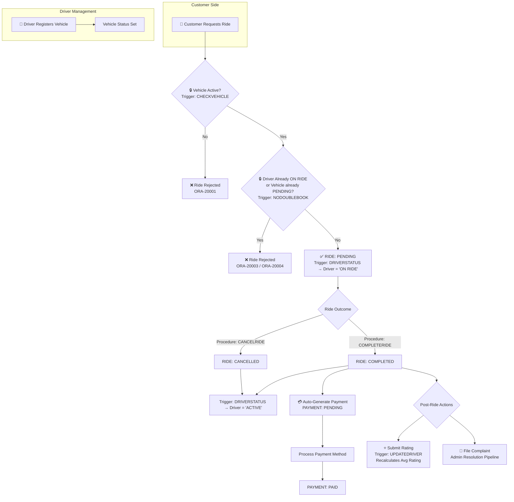
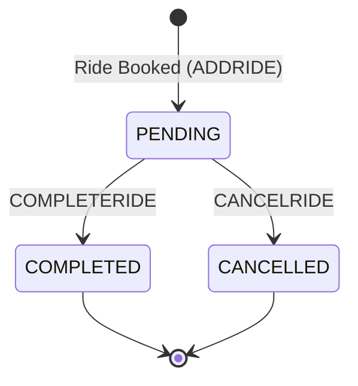
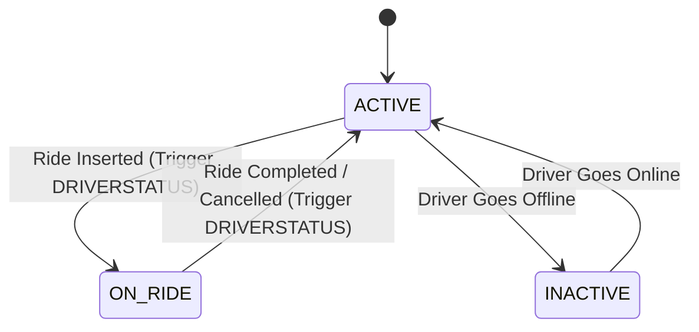
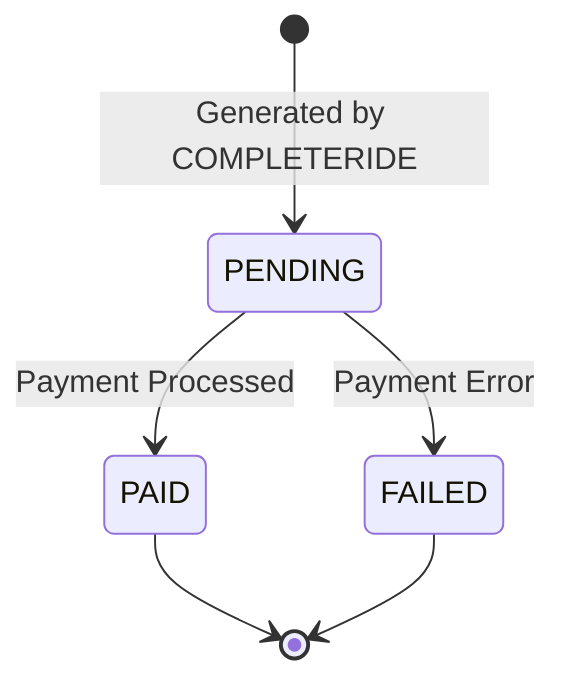
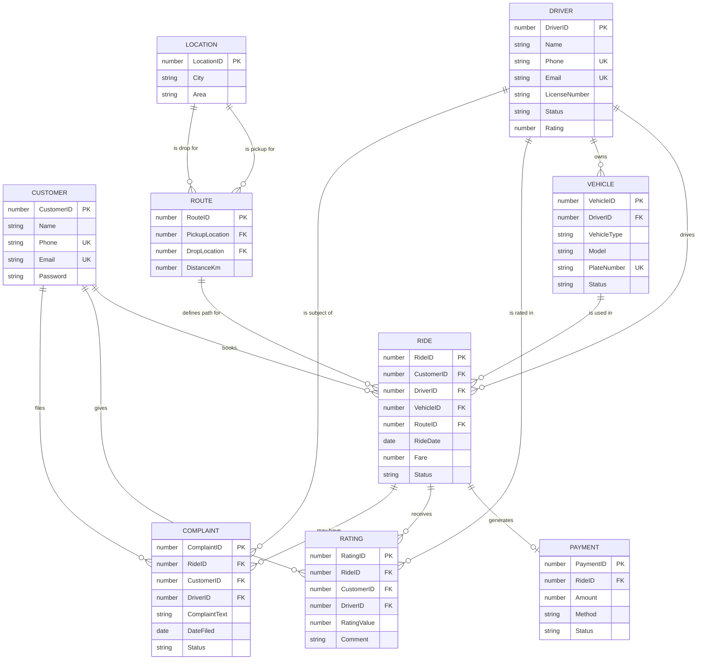
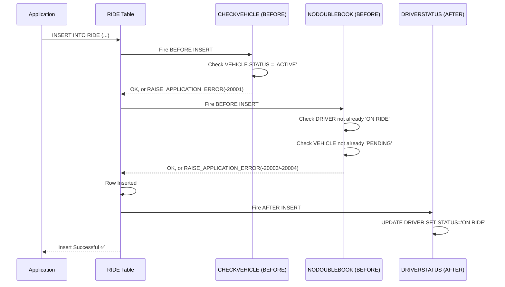
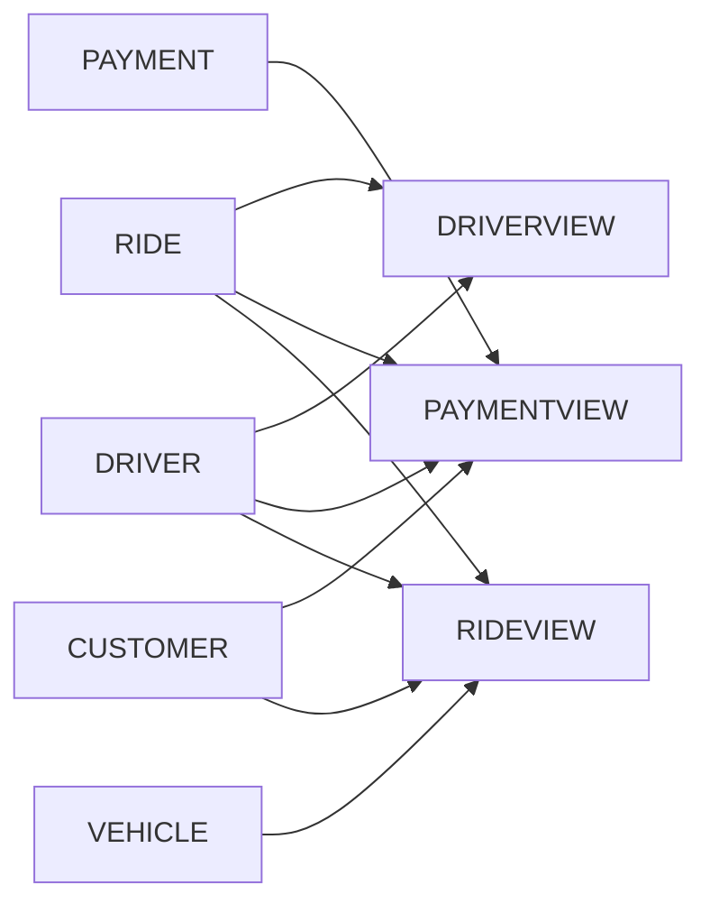
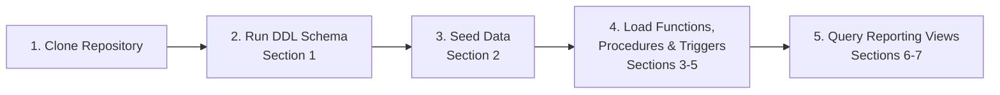

<a id="top"></a>
<div align="center">


<br>


<br><br>


<br><br>


</div>

A robust, enterprise-grade relational database project designed to streamline ride-hailing operations, automate driver-rider management, and simulate the core backend functionalities of modern platforms like **InDrive** and **Uber**. Built on **Oracle SQL & PL/SQL**, the system features secure data constraints, dynamic business validation via database triggers, automated fare calculations, and modular analytical reporting views.

---

## 📖 Table of Contents

<details open>
<summary><b>Click to expand / collapse</b></summary>

- [📖 About the Project](#about)
- [🎯 Project Objectives](#objectives)
- [✨ Features](#features)
- [🛠️ Technologies Used](#tech)
- [🗺️ System Workflow — Visual Architecture](#workflow)
- [🔄 Ride & Driver Lifecycle (State Diagrams)](#states)
- [📐 Database Schema — ER Diagram](#erd)
- [🗂️ Normalized Relational Mapping](#mapping)
- [📌 1. Data Definition Layer (DDL Schema)](#ddl)
- [📌 2. Data Manipulation Layer (Seed Data)](#dml)
- [📌 3. Business Logic Layer (PL/SQL Functions)](#functions)
- [📌 4. Transactional Processing Layer (PL/SQL Procedures)](#procedures)
- [📌 5. Invariant Assertion Layer (Database Triggers)](#triggers)
- [🔁 Trigger Execution Timeline](#trigger-timeline)
- [📌 6. Presentation & Reporting Views](#views)
- [📌 7. Analytical Management Reports](#reports)
- [⚠️ Engineering Notes — Known Issues & Future Improvements](#issues)
- [🚀 Setup & Execution Instructions](#setup)
- [🎓 Academic Context & Authorship](#academic)
- [👨‍💻 Author](#author)
- [📜 License](#license)
- [⭐ Support](#support)

</details>

---

<a id="about"></a>
## 📖 About the Project

Efficient transport logistics require an underlying data structure capable of processing thousands of requests, matching assets dynamically, evaluating service quality, and maintaining strict financial accountability.

This project delivers a complete backend framework for a **Ride Management System**. It models real-world marketplace operations including customer booking flows, real-time driver availability management, multi-modal vehicle classification, distance-based pricing models, payment transaction statuses, and customer service escalation metrics.

The project was developed as part of the **Database Systems** course at Punjab University College of Information Technology (PUCIT) to demonstrate production-ready relational modeling and advanced database programming.

<div align="right"><a href="#top">⬆️ Back to Top</a></div>

---

<a id="objectives"></a>
## 🎯 Project Objectives

| Objective | Description |
|-----------|--------------|
| 📐 **Relational Schema Excellence** | Design a highly normalized relational schema with zero structural redundancy |
| 🔒 **Data Integrity & Enforcement** | Implement declarative constraints alongside advanced validation states |
| 💰 **Automated Dynamic Pricing** | Create procedural database functions to compute fares instantaneously based on route parameters |
| 🛡️ **Race-Condition & Double-Booking Prevention** | Block multi-allocation of assets using transactional before-insert checks |
| 📊 **Business Intelligence Isolation** | Provide abstracted reporting pipelines using structured database views for financial auditing and performance tracking |

<div align="right"><a href="#top">⬆️ Back to Top</a></div>

---

<a id="features"></a>
## ✨ Features

| Feature | Description |
|---------|--------------|
| 👥 **Comprehensive User Profiles** | Segregated records with security placeholders and unique constraint validation for emails and phone numbers |
| 🛠️ **Real-Time Lifecycle Tracking** | Contextual status tracking for Drivers (`ACTIVE`, `INACTIVE`, `ON RIDE`) and Rides (`PENDING`, `COMPLETED`, `CANCELLED`) |
| 🚙 **Flexible Fleet Mapping** | Driver-to-vehicle foreign key mapping accommodating multi-vehicle operational profiling |
| 📍 **Normalized Spatial Routing** | Double-hop routing mapping pickup location IDs and drop location IDs to physical geographic lookups |
| 💳 **Transactional Reconciliation** | Ledger logs tracking payment methods (`CASH`, `CARD`, `WALLET`) and operational execution loops |
| 🌟 **Dynamic Quality Aggregation** | Automated background metric loops calculating running average ratings for service providers |
| ⚠️ **Asynchronous Customer Escalation** | Structural logging pipelines capturing multi-party system grievances and settlement markers |

<div align="right"><a href="#top">⬆️ Back to Top</a></div>

---

<a id="tech"></a>
## 🛠️ Technologies Used

| Technology | Purpose |
|------------|---------|
| **Oracle Database** | Relational Database Engine Provider |
| **SQL / DDL** | Schema Design, Data Definition, & Entity Structure |
| **DML Statements** | Transactional Simulation & Relational Record Injection |
| **PL/SQL Functions** | Modular Algorithmic Logic & Business Calculations |
| **PL/SQL Procedures** | Transaction Processing & Complex Multistep Operations |
| **Database Triggers** | Automatic State Invariants & Declarative Constraints |
| **Oracle APEX / SQL Developer** | Query Execution Environment & Schema Diagnostics |

<p align="center">


</p>

<div align="right"><a href="#top">⬆️ Back to Top</a></div>

---

<a id="workflow"></a>
## 🗺️ System Workflow — Visual Architecture



<div align="right"><a href="#top">⬆️ Back to Top</a></div>

---

<a id="states"></a>
## 🔄 Ride & Driver Lifecycle (State Diagrams)

### 🚕 Ride Status Lifecycle



### 👨‍✈️ Driver Status Lifecycle



### 💳 Payment Status Lifecycle



<div align="right"><a href="#top">⬆️ Back to Top</a></div>

---

<a id="erd"></a>
## 📐 Database Schema — ER Diagram



<div align="right"><a href="#top">⬆️ Back to Top</a></div>

---

<a id="mapping"></a>
## 🗂️ Normalized Relational Mapping

| Entity | Primary Key | Foreign Keys | Notable Attributes |
|--------|:------------:|----------------|----------------------|
| **CUSTOMER** | CustomerID | — | Name, Phone (UQ), Email (UQ), Password |
| **DRIVER** | DriverID | — | Name, Phone (UQ), Email (UQ), LicenseNumber, Status, Rating |
| **VEHICLE** | VehicleID | DriverID → DRIVER | VehicleType, Model, PlateNumber (UQ), Status |
| **LOCATION** | LocationID | — | City, Area |
| **ROUTE** | RouteID | PickupLocation → LOCATION, DropLocation → LOCATION | DistanceKm |
| **RIDE** | RideID | CustomerID, DriverID, VehicleID, RouteID | RideDate, Fare, Status |
| **PAYMENT** | PaymentID | RideID → RIDE | Amount, Method, Status |
| **RATING** | RatingID | RideID, CustomerID, DriverID | RatingValue, Comment |
| **COMPLAINT** | ComplaintID | RideID, CustomerID, DriverID | ComplaintText, DateFiled, Status |

<details>
<summary><b>📌 Original quick-reference schema block (as originally drafted)</b></summary>

```text
CUSTOMER   (CustomerID [PK], Name, Phone [UQ], Email [UQ], Password)
DRIVER     (DriverID [PK], Name, Phone [UQ], Email [UQ], LicenseNumber, Status, Rating)
VEHICLE    (VehicleID [PK], DriverID [FK], VehicleType, Model, PlateNumber [UQ], Status)
LOCATION   (LocationID [PK], City, Area)
ROUTE      (RouteID [PK], PickupLocation [FK], DropLocation [FK], DistanceKm)
RIDE       (RideID [PK], CustomerID [FK], DriverID [FK], VehicleID [FK], RouteID [FK], RideDate, Fare, Status)
PAYMENT    (PaymentID [PK], RideID [FK], Amount, Method, Status)
RATING     (RatingID [PK], RideID [FK], CustomerID [FK], DriverID [FK], RatingValue, Comment)
COMPLAINT  (ComplaintID [PK], RideID [FK], CustomerID [FK], DriverID [FK], ComplaintText, DateFiled, Status)
```

</details>

<div align="right"><a href="#top">⬆️ Back to Top</a></div>

---

<a id="ddl"></a>
## 📌 1. Data Definition Layer (DDL Schema)

<details open>
<summary><b>📄 Click to expand all 9 CREATE TABLE statements</b></summary>

**Create Customer Table**
```sql
CREATE TABLE CUSTOMER(
    CUSTOMERID NUMBER(4) PRIMARY KEY,
    NAME VARCHAR2(50) NOT NULL,
    PHONE VARCHAR2(15) UNIQUE,
    EMAIL VARCHAR2(50) UNIQUE,
    PASSWORD VARCHAR2(20) NOT NULL
);
```

**Create Driver Table**
```sql
CREATE TABLE DRIVER(
    DRIVERID NUMBER(4) PRIMARY KEY,
    NAME VARCHAR2(50) NOT NULL,
    PHONE VARCHAR2(15) UNIQUE,
    EMAIL VARCHAR2(50) UNIQUE,
    LICENSENUMBER VARCHAR2(20) NOT NULL,
    STATUS VARCHAR2(15) CHECK(STATUS IN ('ACTIVE', 'INACTIVE', 'ON RIDE')) DEFAULT 'ACTIVE',
    RATING NUMBER(2) CHECK(RATING BETWEEN 0 AND 5)
);
```

**Create Vehicle Table**
```sql
CREATE TABLE VEHICLE(
    VEHICLEID NUMBER(4) PRIMARY KEY,
    DRIVERID NUMBER(4),
    VEHICLETYPE VARCHAR2(20) NOT NULL,
    MODEL VARCHAR2(30) NOT NULL,
    PLATENUMBER VARCHAR2(15) UNIQUE, 
    STATUS VARCHAR2(15) NOT NULL,
    FOREIGN KEY(DRIVERID) REFERENCES DRIVER(DRIVERID)
);
```

**Create Location Table**
```sql
CREATE TABLE LOCATION(
    LOCATIONID NUMBER(4) PRIMARY KEY,
    CITY VARCHAR2(30) NOT NULL,
    AREA VARCHAR2(30) NOT NULL
);
```

**Create Route Table**
```sql
CREATE TABLE ROUTE(
    ROUTEID NUMBER(4) PRIMARY KEY,
    PICKUPLOCATION NUMBER(4),
    DROPLOCATION NUMBER(4),
    DISTANCEKM NUMBER(5) CHECK(DISTANCEKM>0),
    FOREIGN KEY(PICKUPLOCATION) REFERENCES LOCATION(LOCATIONID), 
    FOREIGN KEY(DROPLOCATION) REFERENCES LOCATION(LOCATIONID)
);
```

**Create Ride Table**
```sql
CREATE TABLE RIDE(
    RIDEID NUMBER(4) PRIMARY KEY,
    CUSTOMERID NUMBER(4),
    DRIVERID NUMBER(4),
    VEHICLEID NUMBER(4),
    ROUTEID NUMBER(4),
    RIDEDATE DATE NOT NULL,
    FARE NUMBER(6) CHECK(FARE>0),
    STATUS VARCHAR2(15) CHECK(STATUS IN ('PENDING', 'COMPLETED', 'CANCELLED')) DEFAULT 'PENDING',
    FOREIGN KEY(CUSTOMERID) REFERENCES CUSTOMER(CUSTOMERID), 
    FOREIGN KEY(DRIVERID) REFERENCES DRIVER(DRIVERID), 
    FOREIGN KEY(VEHICLEID) REFERENCES VEHICLE(VEHICLEID), 
    FOREIGN KEY(ROUTEID) REFERENCES ROUTE(ROUTEID)
);
```

**Create Payment Table**
```sql
CREATE TABLE PAYMENT(
    PAYMENTID NUMBER(4) PRIMARY KEY,
    RIDEID NUMBER(4),
    AMOUNT NUMBER(6) NOT NULL,
    METHOD VARCHAR2(20) CHECK(METHOD IN ('CASH', 'CARD', 'WALLET')),
    STATUS VARCHAR2(15) CHECK(STATUS IN('PAID', 'PENDING', 'FAILED')) DEFAULT 'PENDING', 
    FOREIGN KEY(RIDEID) REFERENCES RIDE(RIDEID)
);
```

**Create Rating Table**
```sql
CREATE TABLE RATING(
    RATINGID NUMBER(4) PRIMARY KEY,
    RIDEID NUMBER(4),
    CUSTOMERID NUMBER(4),
    DRIVERID NUMBER(4),
    RATINGVALUE NUMBER(2) CHECK(RATINGVALUE BETWEEN 1 AND 5),
    COMMENT VARCHAR2(100),
    FOREIGN KEY(RIDEID) REFERENCES RIDE(RIDEID), 
    FOREIGN KEY(CUSTOMERID) REFERENCES CUSTOMER(CUSTOMERID), 
    FOREIGN KEY(DRIVERID) REFERENCES DRIVER(DRIVERID)
);
```

**Create Complaint Table**
```sql
CREATE TABLE COMPLAINT(
    COMPLAINTID NUMBER(4) PRIMARY KEY,
    RIDEID NUMBER(4),
    CUSTOMERID NUMBER(4),
    DRIVERID NUMBER(4),
    COMPLAINTTEXT VARCHAR2(200) NOT NULL,
    DATEFILED DATE DEFAULT SYSDATE,
    STATUS VARCHAR2(15) CHECK(STATUS IN('PENDING', 'RESOLVED', 'REJECTED')) DEFAULT 'PENDING',
    FOREIGN KEY(RIDEID) REFERENCES RIDE(RIDEID), 
    FOREIGN KEY(CUSTOMERID) REFERENCES CUSTOMER(CUSTOMERID),
    FOREIGN KEY(DRIVERID) REFERENCES DRIVER(DRIVERID)
);
```

</details>

<div align="right"><a href="#top">⬆️ Back to Top</a></div>

---

<a id="dml"></a>
## 📌 2. Data Manipulation Layer (Seed Data)

<details>
<summary><b>📄 Click to expand all 78 seed INSERT statements</b></summary>

**Customer Table Inserts**
```sql
INSERT INTO CUSTOMER VALUES (1, 'Ali Khan', '03001234567', 'ali@gmail.com', 'ali123');
INSERT INTO CUSTOMER VALUES (2, 'Sara Ahmed', '03007654321', 'sara@gmail.com', 'sara123');
INSERT INTO CUSTOMER VALUES (3, 'Bilal Tariq', '03004567890', 'bilal@gmail.com', 'bilal123');
INSERT INTO CUSTOMER VALUES (4, 'Hina Shah', '03111223344', 'hina@gmail.com', 'hina123');
INSERT INTO CUSTOMER VALUES (5, 'Omar Farooq', '03222333444', 'omar@gmail.com', 'omar123');
INSERT INTO CUSTOMER VALUES (6, 'Ayesha Khan', '03333444555', 'ayesha@gmail.com', 'ayesha123');
INSERT INTO CUSTOMER VALUES (7, 'Hamza Ali', '03444555666', 'hamza@gmail.com', 'hamza123');
INSERT INTO CUSTOMER VALUES (8, 'Noor Fatima', '03555666777', 'noor@gmail.com', 'noor123');
INSERT INTO CUSTOMER VALUES (9, 'Saad Khan', '03666777888', 'saad@gmail.com', 'saad123');
INSERT INTO CUSTOMER VALUES (10, 'Iqra Malik', '03777888999', 'iqra@gmail.com', 'iqra123');
```

**Driver Table Inserts**
```sql
INSERT INTO DRIVER VALUES (1, 'Ahmed Raza', '03112223333', 'ahmed@gmail.com', 'LIC12345', 'ACTIVE', 5);
INSERT INTO DRIVER VALUES (2, 'Usman Ali', '03222333444', 'usman@gmail.com', 'LIC67890', 'INACTIVE', 4);
INSERT INTO DRIVER VALUES (3, 'Farooq Sheikh', '03333444555', 'farooq@gmail.com', 'LIC54321', 'ACTIVE', 3);
INSERT INTO DRIVER VALUES (4, 'Sana Tariq', '03444555666', 'sana@gmail.com', 'LIC98765', 'ACTIVE', 5);
INSERT INTO DRIVER VALUES (5, 'Adnan Qureshi', '03555666777', 'adnan@gmail.com', 'LIC24680', 'INACTIVE', 4);
INSERT INTO DRIVER VALUES (6, 'Zara Khan', '03666777888', 'zara@gmail.com', 'LIC13579', 'ACTIVE', 5);
INSERT INTO DRIVER VALUES (7, 'Kamran Shah', '03777888999', 'kamran@gmail.com', 'LIC11223', 'ACTIVE', 4);
INSERT INTO DRIVER VALUES (8, 'Hassan Raza', '03888990000', 'hassan@gmail.com', 'LIC44556', 'ACTIVE', 4);
INSERT INTO DRIVER VALUES (9, 'Faizan Khan', '03999001111', 'faizan@gmail.com', 'LIC77889', 'ACTIVE', 5);
INSERT INTO DRIVER VALUES (10, 'Iqra Malik', '04000112233', 'iqra.driver@gmail.com', 'LIC99000', 'ACTIVE', 5);
```

**Vehicle Table Inserts**
```sql
INSERT INTO VEHICLE VALUES (1, 1, 'Car', 'Toyota Corolla', 'LHR-123', 'ACTIVE');
INSERT INTO VEHICLE VALUES (2, 2, 'Bike', 'Honda CG125', 'LHR-456', 'INACTIVE');
INSERT INTO VEHICLE VALUES (3, 3, 'Rickshaw', 'Suzuki Rickshaw', 'KHI-789', 'ACTIVE');
INSERT INTO VEHICLE VALUES (4, 4, 'Car', 'Honda Civic', 'ISB-321', 'ACTIVE');
INSERT INTO VEHICLE VALUES (5, 5, 'Van', 'Toyota Hiace', 'ISB-654', 'INACTIVE');
INSERT INTO VEHICLE VALUES (6, 6, 'Bike', 'Yamaha YBR', 'KHI-987', 'ACTIVE');
INSERT INTO VEHICLE VALUES (7, 7, 'Car', 'Suzuki Swift', 'LHR-789', 'ACTIVE');
INSERT INTO VEHICLE VALUES (8, 8, 'Bike', 'Honda CB125', 'KHI-654', 'ACTIVE');
INSERT INTO VEHICLE VALUES (9, 9, 'Car', 'Honda Accord', 'ISB-987', 'ACTIVE');
INSERT INTO VEHICLE VALUES (10, 10, 'Bike', 'Suzuki GS150', 'LHR-321', 'ACTIVE');
```

**Location Table Inserts**
```sql
INSERT INTO LOCATION VALUES (1, 'Lahore', 'Model Town');
INSERT INTO LOCATION VALUES (2, 'Lahore', 'Johar Town');
INSERT INTO LOCATION VALUES (3, 'Karachi', 'Gulshan');
INSERT INTO LOCATION VALUES (4, 'Karachi', 'Clifton');
INSERT INTO LOCATION VALUES (5, 'Islamabad', 'F-7');
INSERT INTO LOCATION VALUES (6, 'Islamabad', 'G-10');
INSERT INTO LOCATION VALUES (7, 'Lahore', 'DHA');
INSERT INTO LOCATION VALUES (8, 'Karachi', 'PECHS');
INSERT INTO LOCATION VALUES (9, 'Islamabad', 'I-8');
INSERT INTO LOCATION VALUES (10, 'Lahore', 'Wapda Town');
```

**Route Table Inserts**
```sql
INSERT INTO ROUTE VALUES (1, 1, 2, 12);
INSERT INTO ROUTE VALUES (2, 2, 1, 10);
INSERT INTO ROUTE VALUES (3, 3, 4, 15);
INSERT INTO ROUTE VALUES (4, 4, 3, 15);
INSERT INTO ROUTE VALUES (5, 5, 6, 8);
INSERT INTO ROUTE VALUES (6, 6, 5, 8);
INSERT INTO ROUTE VALUES (7, 7, 2, 10);
INSERT INTO ROUTE VALUES (8, 8, 3, 12);
INSERT INTO ROUTE VALUES (9, 9, 6, 15);
INSERT INTO ROUTE VALUES (10, 10, 2, 10);
```

**Ride Table Inserts**
```sql
INSERT INTO RIDE VALUES (1, 1, 1, 1, 1, TO_DATE('2025-12-21','YYYY-MM-DD'), 850, 'Completed');
INSERT INTO RIDE VALUES (2, 2, 2, 2, 2, TO_DATE('2025-12-21','YYYY-MM-DD'), 600, 'Pending');
INSERT INTO RIDE VALUES (3, 3, 3, 3, 3, TO_DATE('2025-12-21','YYYY-MM-DD'), 1200, 'Completed');
INSERT INTO RIDE VALUES (4, 4, 4, 4, 4, TO_DATE('2025-12-21','YYYY-MM-DD'), 900, 'Pending');
INSERT INTO RIDE VALUES (5, 5, 5, 5, 5, TO_DATE('2025-12-21','YYYY-MM-DD'), 750, 'Completed');
INSERT INTO RIDE VALUES (6, 6, 6, 6, 6, TO_DATE('2025-12-21','YYYY-MM-DD'), 1100, 'Pending');
INSERT INTO RIDE VALUES (7, 7, 7, 7, 7, TO_DATE('2025-12-21','YYYY-MM-DD'), 950, 'Completed');
INSERT INTO RIDE VALUES (8, 8, 8, 8, 8, TO_DATE('2025-12-21','YYYY-MM-DD'), 500, 'Pending');
INSERT INTO RIDE VALUES (9, 9, 9, 9, 9, TO_DATE('2025-12-21','YYYY-MM-DD'), 1300, 'Completed');
INSERT INTO RIDE VALUES (10, 10, 10, 10, 10, TO_DATE('2025-12-21','YYYY-MM-DD'), 700, 'Pending');
```

**Payment Table Inserts**
```sql
INSERT INTO PAYMENT VALUES (1, 1, 850, 'Cash', 'Paid');
INSERT INTO PAYMENT VALUES (2, 2, 600, 'Card', 'Pending');
INSERT INTO PAYMENT VALUES (3, 3, 1200, 'Wallet', 'Paid');
INSERT INTO PAYMENT VALUES (4, 4, 900, 'Cash', 'Pending');
INSERT INTO PAYMENT VALUES (5, 5, 750, 'Card', 'Paid');
INSERT INTO PAYMENT VALUES (6, 6, 1100, 'Wallet', 'Pending');
INSERT INTO PAYMENT VALUES (7, 7, 950, 'Cash', 'Paid');
INSERT INTO PAYMENT VALUES (8, 8, 500, 'Card', 'Pending');
INSERT INTO PAYMENT VALUES (9, 9, 1300, 'Wallet', 'Paid');
INSERT INTO PAYMENT VALUES (10, 10, 700, 'Cash', 'Pending');
```

**Rating Table Inserts**
```sql
INSERT INTO RATING VALUES (1, 1, 1, 1, 5, 'Excellent ride');
INSERT INTO RATING VALUES (2, 3, 3, 3, 4, 'Good service');
INSERT INTO RATING VALUES (3, 5, 5, 5, 3, 'Average ride');
INSERT INTO RATING VALUES (4, 7, 7, 7, 1, 'Late arrival');
INSERT INTO RATING VALUES (5, 9, 9, 9, 5, 'Excellent service');
```

**Complaint Table Inserts**
```sql
INSERT INTO COMPLAINT VALUES (1, 3, 4, 4, 'Vehicle was dirty', TO_DATE('2025-12-21', 'YYYY-MM-DD'), 'Pending');
INSERT INTO COMPLAINT VALUES (2, 5, 6, 6, 'Driver misbehaved', TO_DATE('2025-12-21','YYYY-MM-DD'), 'Pending');
INSERT INTO COMPLAINT VALUES (3, 7, 7, 7, 'Driver arrived late', TO_DATE('2025-12-21','YYYY-MM-DD'), 'Pending');
```

</details>

<div align="right"><a href="#top">⬆️ Back to Top</a></div>

---

<a id="functions"></a>
## 📌 3. Business Logic Layer (PL/SQL Functions)

### 💰 Route-Based Automated Pricing Function

Computes ride costs instantly using route input parameters paired with a fixed rate constant (20 PKR/KM).

```sql
CREATE OR REPLACE FUNCTION CALCULATEFARE (ROUTEID NUMBER)
RETURN NUMBER IS
    DIST NUMBER;
BEGIN
    SELECT DISTANCEKM INTO DIST FROM ROUTE WHERE ROUTEID = ROUTEID;
    RETURN DIST * 20;
END;
/
```

### ⭐ Driver Rating Aggregate Function

Safely computes real-time dynamic rating means, filtering null instances gracefully via a fallback handler.

```sql
CREATE OR REPLACE FUNCTION DRIVERRATING (DRIVERID NUMBER)
RETURN NUMBER IS
    AVGRATE NUMBER;
BEGIN
    SELECT AVG(RATINGVALUE) INTO AVGRATE FROM RATING WHERE DRIVERID = DRIVERID;
    RETURN NVL (AVGRATE, 0);
END;
/
```

<div align="right"><a href="#top">⬆️ Back to Top</a></div>

---

<a id="procedures"></a>
## 📌 4. Transactional Processing Layer (PL/SQL Procedures)

### 🚕 Ride Initiation Pipeline

Automates the checkout stream, binding the dynamic calculation function output into the system insertion ledger.

```sql
CREATE OR REPLACE PROCEDURE ADDRIDE (CUSTOMERID NUMBER, DRIVERID NUMBER, VEHICLEID NUMBER, ROUTEID NUMBER) IS
    FARE NUMBER;
BEGIN
    FARE := CALCULATEFARE (ROUTEID);
    INSERT INTO RIDE VALUES (RIDESEQ.NEXTVAL, CUSTOMERID, DRIVERID, VEHICLEID, ROUTEID, SYSDATE, FARE, 'PENDING');
END;
/
```

### ✅ Trip Completion Process

Updates the ride state to `COMPLETED` and instantly transfers state parameters to the payment table to issue a cash invoice.

```sql
CREATE OR REPLACE PROCEDURE COMPLETERIDE (RIDEID NUMBER) IS
BEGIN
    UPDATE RIDE SET STATUS='COMPLETED' WHERE RIDEID=RIDEID;
    INSERT INTO PAYMENT (PAYMENTID, RIDEID, AMOUNT, METHOD, STATUS)
    SELECT PAYMENTSEQ.NEXTVAL, RIDEID, FARE, 'CASH', 'PENDING' FROM RIDE WHERE RIDEID=RIDEID;
    COMMIT;
END;
/
```

### ❌ Cancel Ride Procedure

Modifies a transaction record's state instantly to handle active cancellation events.

```sql
CREATE OR REPLACE PROCEDURE CANCELRIDE (RIDEID NUMBER) IS
BEGIN
    UPDATE RIDE SET STATUS='CANCELLED' WHERE RIDEID=RIDEID;
END;
/
```

### 📝 Update Complaint Procedure

Updates management administrative workflow lifecycles for target customer support requests.

```sql
CREATE OR REPLACE PROCEDURE UPDATECOMPLAINT (COMPLAINTID NUMBER, NEWSTATUS VARCHAR2) IS
BEGIN
    UPDATE COMPLAINT SET STATUS=NEWSTATUS WHERE COMPLAINTID=COMPLAINTID;
END;
/
```

<div align="right"><a href="#top">⬆️ Back to Top</a></div>

---

<a id="triggers"></a>
## 📌 5. Invariant Assertion Layer (Database Triggers)

### 🔒 Asset Invariant Check (Active Verification)

Guards the trip insertion sequence, ensuring that inactive vehicle records reject target matching instances.

```sql
CREATE OR REPLACE TRIGGER CHECKVEHICLE
BEFORE INSERT ON RIDE FOR EACH ROW
DECLARE
    VSTATUS VARCHAR2(15);
BEGIN
    SELECT STATUS INTO VSTATUS FROM VEHICLE WHERE VEHICLEID=: NEW.VEHICLEID;
    IF VSTATUS<> 'ACTIVE' THEN
        RAISE_APPLICATION_ERROR(-20001, 'VEHICLE NOT ACTIVE'); 
    END IF;
END;
/
```

### 🌟 Dynamic Quality Aggregation Trigger

Automatically updates the consolidated metrics within the Driver registry whenever a new user rating is posted.

```sql
CREATE OR REPLACE TRIGGER UPDATEDRIVER
AFTER INSERT ON RATING FOR EACH ROW
BEGIN
    UPDATE DRIVER SET RATING = (SELECT AVG(RATINGVALUE) FROM RATING WHERE DRIVERID=: NEW.DRIVERID)
    WHERE DRIVERID=: NEW.DRIVERID;
END;
/
```

### 🛡️ Race-Condition & Concurrent Allocation Prevention

Defends schema integrity by throwing exceptions if a driver is currently `ON RIDE` or a car is already in a `PENDING` transaction.

```sql
CREATE OR REPLACE TRIGGER NODOUBLEBOOK
BEFORE INSERT ON RIDE FOR EACH ROW
DECLARE
    CNT NUMBER;
BEGIN
    SELECT COUNT(*) INTO CNT FROM DRIVER WHERE DRIVERID=: NEW.DRIVERID AND STATUS='ON RIDE';
    IF CNT > 0 THEN 
        RAISE_APPLICATION_ERROR(-20003, 'DRIVER ALREADY ON RIDE'); 
    END IF;
    
    SELECT COUNT(*) INTO CNT FROM RIDE WHERE VEHICLEID=: NEW.VEHICLEID AND STATUS='PENDING';
    IF CNT > 0 THEN 
        RAISE_APPLICATION_ERROR(-20004, 'VEHICLE ALREADY IN USE'); 
    END IF;
END;
/
```

### 🔁 Reactive Driver State Automaton

Ensures that runtime profile states shift automatically during booking or completion lifecycles.

```sql
CREATE OR REPLACE TRIGGER DRIVERSTATUS
AFTER INSERT OR UPDATE OF STATUS ON RIDE FOR EACH ROW
BEGIN
    IF INSERTING THEN 
        UPDATE DRIVER SET STATUS = 'ON RIDE' WHERE DRIVERID=: NEW.DRIVERID;
    ELSIF UPDATING AND :NEW.STATUS IN ('COMPLETED', 'CANCELLED') THEN 
        UPDATE DRIVER SET STATUS = 'ACTIVE' WHERE DRIVERID=: NEW.DRIVERID;
    END IF;
END;
/
```

<div align="right"><a href="#top">⬆️ Back to Top</a></div>

---

<a id="trigger-timeline"></a>
## 🔁 Trigger Execution Timeline

What actually happens, in order, the instant a new row is inserted into `RIDE`:



<div align="right"><a href="#top">⬆️ Back to Top</a></div>

---

<a id="views"></a>
## 📌 6. Presentation & Reporting Views

### 📊 Operational Driver Metrics View

```sql
CREATE OR REPLACE VIEW DRIVERVIEW AS
SELECT D.DRIVERID, D.NAME, COUNT(R.RIDEID) TOTALRIDES, 
       SUM(CASE WHEN R.STATUS = 'COMPLETED' THEN 1 ELSE 0 END) COMPLETEDRIDES, D.RATING 
FROM DRIVER D LEFT JOIN RIDE R ON D.DRIVERID = R.DRIVERID
GROUP BY D.DRIVERID, D.NAME, D.RATING;
```

### 💵 Audit-Ready Financial Ledger View

```sql
CREATE OR REPLACE VIEW PAYMENTVIEW AS
SELECT P.PAYMENTID, C.NAME CUSTOMER, D.NAME DRIVER, P.AMOUNT, P.METHOD, P.STATUS FROM PAYMENT P
JOIN RIDE R ON P.RIDEID=R.RIDEID
JOIN CUSTOMER C ON R.CUSTOMERID=C.CUSTOMERID
JOIN DRIVER D ON R.DRIVERID=D.DRIVERID;
```

### 🧾 Consolidated Ride Logistics View

```sql
CREATE OR REPLACE VIEW RIDEVIEW AS
SELECT R.RIDEID, C.NAME CUSTOMER, D.NAME DRIVER, V.VEHICLETYPE || ' ' || V.MODEL VEHICLE, R.RIDEDATE, R.FARE, R.STATUS 
FROM RIDE R
JOIN CUSTOMER C ON R.CUSTOMERID=C.CUSTOMERID
JOIN DRIVER D ON R.DRIVERID=D.DRIVERID
JOIN VEHICLE V ON R.VEHICLEID = V.VEHICLEID;
```

### 🔗 View Dependency Map



<div align="right"><a href="#top">⬆️ Back to Top</a></div>

---

<a id="reports"></a>
## 📌 7. Analytical Management Reports

| # | Report | Purpose |
|---|--------|---------|
| 1️⃣ | Total Rides Per Customer | Ranks customers by ride volume |
| 2️⃣ | All Complaints | Full grievance audit trail across customers and drivers |
| 3️⃣ | Active Vehicle Status Fleet | Live fleet availability snapshot |
| 4️⃣ | Pending Rides Management Dashboard | Operational view of rides awaiting completion |
| 5️⃣ | Completed Trips Revenue | Revenue reporting for finished trips |

<details>
<summary><b>📄 Click to expand all 5 report queries</b></summary>

**1) Total Rides Per Customer Report**
```sql
SELECT C.CUSTOMERID, C.NAME, COUNT(R.RIDEID) TOTALRIDES 
FROM CUSTOMER C JOIN RIDE R ON C.CUSTOMERID=R.CUSTOMERID 
GROUP BY C.CUSTOMERID, C.NAME 
ORDER BY TOTALRIDES DESC;
```

**2) All Complaints Report**
```sql
SELECT C.COMPLAINTID, R.RIDEID, CU.NAME CUSTOMER, D.NAME DRIVER, C.COMPLAINTTEXT, C.DATEFILED, C.STATUS 
FROM COMPLAINT C 
JOIN CUSTOMER CU ON C.CUSTOMERID=CU.CUSTOMERID 
JOIN DRIVER D ON C.DRIVERID=D.DRIVERID 
JOIN RIDE R ON C.RIDEID = R.RIDEID;
```

**3) Active Vehicle Status Fleet Report**
```sql
SELECT V.VEHICLEID, D.NAME DRIVER, V.VEHICLETYPE||' '||V.MODEL VEHICLE, V.STATUS 
FROM VEHICLE V JOIN DRIVER D ON V.DRIVERID=D.DRIVERID;
```

**4) Pending Rides Management Dashboard**
```sql
SELECT R.RIDEID, C.NAME CUSTOMER, D.NAME DRIVER, R.RIDEDATE, R.FARE 
FROM RIDE R JOIN CUSTOMER C ON R.CUSTOMERID=C.CUSTOMERID 
JOIN DRIVER D ON R.DRIVERID = D.DRIVERID 
WHERE R.STATUS='PENDING';
```

**5) Completed Trips Revenue Report**
```sql
SELECT R.RIDEID, C.NAME CUSTOMER, D.NAME DRIVER, R.RIDEDATE, R.FARE 
FROM RIDE R JOIN CUSTOMER C ON R.CUSTOMERID=C.CUSTOMERID 
JOIN DRIVER D ON R.DRIVERID=D.DRIVERID 
WHERE R.STATUS='COMPLETED';
```

</details>

<div align="right"><a href="#top">⬆️ Back to Top</a></div>

---

<a id="issues"></a>
## ⚠️ Engineering Notes — Known Issues & Future Improvements

> These are honest notes for anyone (including future me) picking this project back up — not criticisms, just a real "next steps" list that any production-grade repo should have.

| # | Observation | Why It Matters | Suggested Fix |
|---|--------------|------------------|------------------|
| 1 | **Parameter/column name collisions** in `CALCULATEFARE`, `COMPLETERIDE`, `CANCELRIDE`, and `UPDATECOMPLAINT` (e.g., `WHERE RIDEID = RIDEID`) | PL/SQL resolves the bare identifier to the *column*, not the incoming parameter — so the filter doesn't actually narrow by the value passed in | Prefix parameters, e.g. `p_rideid`, so `WHERE RIDEID = p_rideid` |
| 2 | **`RIDESEQ` and `PAYMENTSEQ` are referenced but never created** in the DDL section | `ADDRIDE` and `COMPLETERIDE` will fail with `ORA-02289: sequence does not exist` until these are defined | Add `CREATE SEQUENCE RIDESEQ START WITH 11 INCREMENT BY 1;` and the equivalent for `PAYMENTSEQ` before running the procedures |
| 3 | **Case mismatch between CHECK constraints and seed data** — constraints expect uppercase (`'COMPLETED'`, `'CASH'`, `'WALLET'`) while some seed `INSERT`s use mixed case (`'Completed'`, `'Cash'`, `'Wallet'`) | Oracle `CHECK` constraints are case-sensitive by default, so those specific rows would be rejected on insert as written | Normalize seed data to uppercase, or relax the constraints with `UPPER()` |

<div align="right"><a href="#top">⬆️ Back to Top</a></div>

---

<a id="setup"></a>
## 🚀 Setup & Execution Instructions

### ✅ Prerequisites

- Installed instance of **Oracle Database Express Edition (XE)** or access to an **Oracle Autonomous Database** cloud workshop interface.
- SQL client management utilities like **Oracle SQL Developer**, **TOAD**, or **Oracle APEX Workspaces**.

### 🗺️ Deployment Roadmap



| Step | Action |
|:----:|--------|
| 1 | Clone the repository system assets locally |
| 2 | Run the code block within **Section 1 (DDL Schema)** to create the table structure and establish reference mappings |
| 3 | Execute the data insertions in **Section 2** to seed test data into the system tables |
| 4 | Load the functions, procedures, and triggers from **Sections 3, 4, and 5** into your database engine to compile the procedural business validation layer |
| 5 | Execute reporting statements directly against the view assets to monitor system operations |

```sql
SELECT * FROM RIDEVIEW WHERE STATUS = 'COMPLETED';
```

<div align="right"><a href="#top">⬆️ Back to Top</a></div>

---

<a id="academic"></a>
## 🎓 Academic Context & Authorship

| Item | Details |
|------|---------|
| 🏫 Institution | University of the Punjab (PU) |
| 🏛 College | Punjab University College of Information Technology (PUCIT) |
| 🏢 Department | Faculty of Computing and Information Technology (FCIT) |
| 📚 Course Assignment | Database Systems Project |
| 👨‍💻 Name | Talha Yaseen |
| 🆔 Roll No | BITF24M041 |
| 👨‍🏫 Target Instructor | Dr. Asif Sohail |
| 🗓 Development Timeline | 3rd Semester |

<div align="right"><a href="#top">⬆️ Back to Top</a></div>

---

<a id="author"></a>
<div align="center">


## 👨‍💻 Author

## Talha Yaseen

*Roll: BITF24M041*

*BS Information Technology*

Database Management System — Ride Sharing System Final Project (2025)

*3rd Semester DBMS Final Project*

### Connect with Me

- 🌐 GitHub: **[github.com/Talha-Yaseen-Hub](https://github.com/Talha-Yaseen-Hub)**
- 💼 LinkedIn: **[linkedin.com/in/talha-yaseen](https://www.linkedin.com/in/talha-yaseen-44a41a341)**
- 📧 Email: **talhavectorarts@gmail.com**

<br>


</div>

<div align="right"><a href="#top">⬆️ Back to Top</a></div>

---

<a id="license"></a>
## 📜 License

<div align="center">


This project is licensed under the **MIT License** — see the [LICENSE](./LICENSE) file for full details.

</div>

<div align="right"><a href="#top">⬆️ Back to Top</a></div>

---

<a id="support"></a>
<div align="center">

# ⭐ Support

If this repository helped you during your semester, consider giving it a **⭐ Star** on GitHub.

Your support encourages me to continue organizing and sharing educational resources with the student community.

<br>

### 🚕 Happy Querying!

### 🌟 *"Data integrity is a continuous verification process, not a one-time schema definition."*

<br>


</div>
